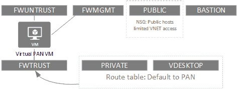
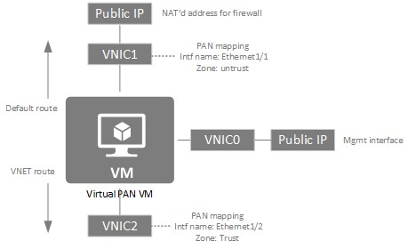
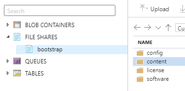
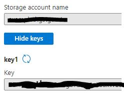

# Deploying PAN VM Series firewall with Terraform on Azure
## Bonus! Panorama Bootstrap via Terraform

You might be asking, why does anyone need a virtual firewall in the public cloud? In the case of Azure you might ask, why Network Security Groups and native logging why do I need a virtual firewall? There are couple possible use cases.
1. A hybrid enterprise with both physical and virtual assests, with centrally managed access control policies.
2. Virtual workloads that have complex policies that require permissionming via FQDN, URL, publicly or privately maintained lists of IPs or URLs, Automatic applicaiton identification.
3. Cloud provided network activity logging is insufficient. In the case of PAN VM firewalls the logging can extract URLs from HTTP requests and provide application visibility. 
4. And importantly - occasionaly circumstances force you to shove brownfield workloads into the cloud. It's an imperfect world. 

All that said, deploying a virtual firewall to control network policy is not the only way to solve these problem problems in the cloud. You can, and others wil,l solve these problems in different ways. Some examples of other methods. 
- Web proxies either hosted or cloud based (e.g. Zscaler)
- Automation tools to orchestrate native cloud tools.
- Cloud native access rules
### Table of content
[Terraform Plan](#Terraform-plan)<br/>
[Understanding the VNET topology](#Understanding-the-VNET-topology)<br/>
[Terraform Mechanics](#Terraform-Mechanics)<br/>
[Understanding the VNET topology](#Understanding-the-VNET-topology)<br/>
[PAN Bootstrap notes](#PAN-Bootstrap-notes)<br/>
[References](References)
### Terraform plan
At the most basic level this plan deploys a Azure VNET with ficitonal topology (public and private subnets, etc), along with a single PAN VM series firewall that is provisioned via the PAN [bootstrap]( https://docs.paloaltonetworks.com/vm-series/9-1/vm-series-deployment/bootstrap-the-vm-series-firewall.html) process using a PAN [Panorama](https://www.paloaltonetworks.com/network-security/panorama) central mgmt server. This example can be used without the bootstrap process and Panorama. But exactly no one wants to manage cloud firewalls individually, well at least I don't. All the details of how to automate deployment of configs and polciies via Panorama is beyond the scope of this document. 

### Terraform Mechanics
There are a wide variety of approaches to implementing Terraform with Azure. When developiong examples like this one, I like using VSCODE w/ the Terraform & Azure extensions. It utilizes the Azure [Cloud Shell](https://docs.microsoft.com/en-us/azure/cloud-shell/overview) service, the TF state file is persisted on a [Clouddrive](https://docs.microsoft.com/en-us/azure/cloud-shell/persisting-shell-storage). The TF state file can be backed up using Azure Recovery Services.

If you are interested using VSCODE Azure Terraform instructions are here:  
[Configure the Azure Terraform Visual Studio Code extension](https://docs.microsoft.com/en-us/azure/developer/terraform/configure-vs-code-extension-for-terraform)

### Understanding the VNET topology
A close reading of this will reveal that the public subnet, there to host publicly accessible workloads, is not sitting on a leg of the virtual firewall. Access control for the public subnet is handled by a Network Security Group (NSG). East-West communication between hosts in an app architecture cannot gain much from the enhanced access control capabilties of a first rate NGFW. Also, it was good opportunity to combine multiple concepts into one example. 



The plan creates only a single route table containiung only default route. In a real world use case it is likely that there will be connections to private networks using a SD-WAN VM, the virtual firewall IPSEC capability or the native Azure VPN Gateway.  

A bit more detail about the specific of the way Azure public IPs and VNICs map to PAN interfaces.



### PAN Bootstrap notes

The bootstrap process allowes a newly provisioned PAN VM firewall to register itself with a PAN Panorama mgmt server and have it's device config and polcilies pushed down to it. It's beyond the scope of this document to explain the details of how to create device configs and shared policies in Panorama. But to get the newly booted firewall to register with the Panorama server. 

1. Create a Azure storage account.
2. Create a file share in the new storage account named "bootstrap"
3. In the file share create the following folder structure:



4. The only folder and file that is required to populate is the config\init-cfg.txt
5. There are 2 parameters that must be populated in the ini-cfg.txt
```
   vm-auth-key=1234567890
   panorama-server=1.1.1.1
```
  - "vm-auth-key" is generated on the Panorama server from the command line using the followinfg [procedure](https://docs.paloaltonetworks.com/vm-series/9-1/vm-series-deployment/bootstrap-the-vm-series-firewall/generate-the-vm-auth-key-on-panorama.html).
  - "panorama" is the public IP address of you Panorama server. (Note: TCP port 3978 and 28443 must be allowed inbound to the Panorama server)
  - I included a sample [init-cfg.txt](bootstrap/init-cfg.txt) in the repository or use the PAN example [init-cfg.txt](https://docs.paloaltonetworks.com/vm-series/9-1/vm-series-deployment/bootstrap-the-vm-series-firewall/create-the-init-cfgtxt-file/sample-init-cfgtxt-file.html#id114bde92-3176-4c7c-a68a-eadfff80cb29)
  - A note on two other parameters in the init-cfg.txt file. "tplname" and "dgname" these are the template name and device group name configured in Panorama. This is how you fully automate configuration. If you have already created a template stack and defined policies you can populate these two fields. 
  - The bootstrap content folder should be populated with threat updates. These can be found in the PAN support portal under [Dynamic Updates](https://support.paloaltonetworks.com/Updates/DynamicUpdates/52078). This allows the firewall to immediatly become operational after the config and policies are pushed down by the Panorama. 
  - The example is configured with a pay-as-you-go license (sku=bundle2), a bring-your-own license can be deployed by switching the sku and plan paramter in the pan.tf to "byol". Also the bootstrap license folder must be populated with a authcodes file that contains the authcode for the firewall being deployed. 

8. Update the init-cfg.txt sample file with your auth key and the panorama server IP address uploqd it to the config folder
9. The last part of this process is to pass the correct parameters to VM via the TF plan file so the PAN VM will be able to download the init-cfg.txt file. 
  - There are 3 parameters that must be passed in the plan file 1. "storage-account" 2. "access-key 3. "file-share". This is section of the pan.tf file from the repository:
  ```
    os_profile {
    computer_name  = var.FirewallVmName
    admin_username = "yourusername"
    admin_password = "yourpassword"
    custom_data = join(
      ",",
      [
       "storage-account=<storage account name>",
       "access-key=<storge acct access key>",
       "file-share=bootstrap",
       "share-directory=None"
      ],
    )
  }
  ```
  - storage-account and access-key can be both be retrieved via the Azure portal. Locate the storage account you created and click on the Access Keys menu.
  
  
  
  - share-directory is "bootstrap" because that is what suggested it be named in step 2
  
  
  ### References
  [PaloAltoNetworks/terraform-azurerm-panos-bootstrap](https://github.com/PaloAltoNetworks/terraform-azurerm-panos-bootstrap)
  [Terraform Azure](https://www.terraform.io/docs/providers/azurerm/index.html)
  
  
